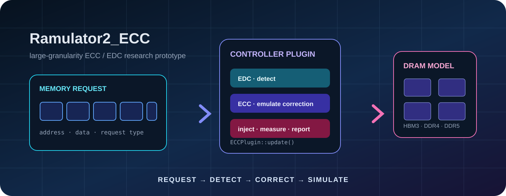
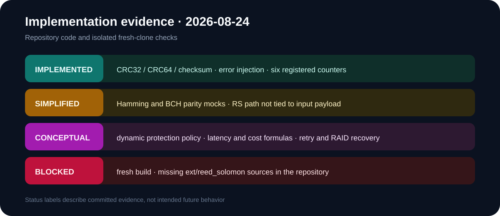
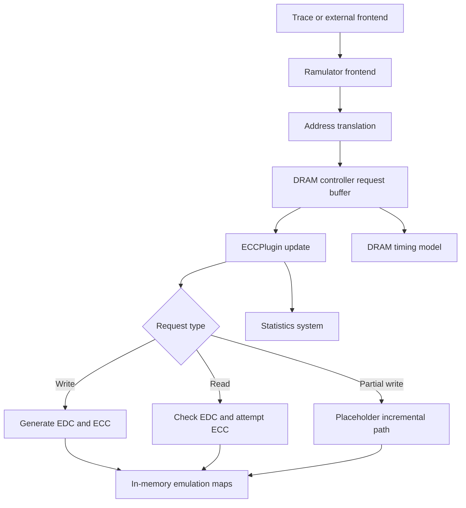
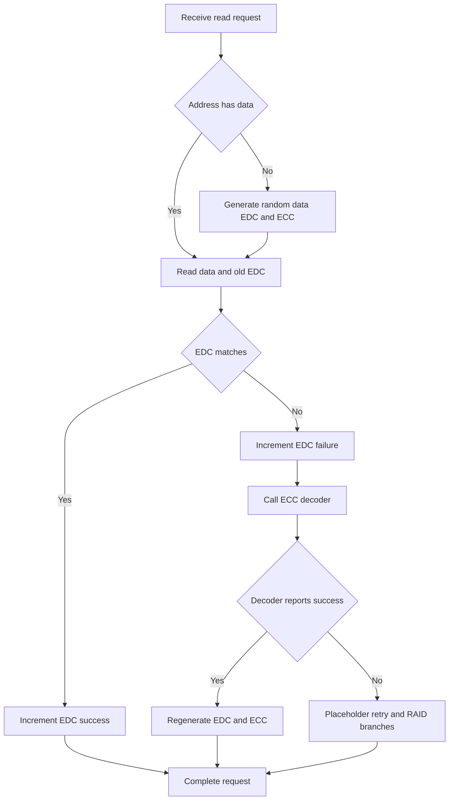
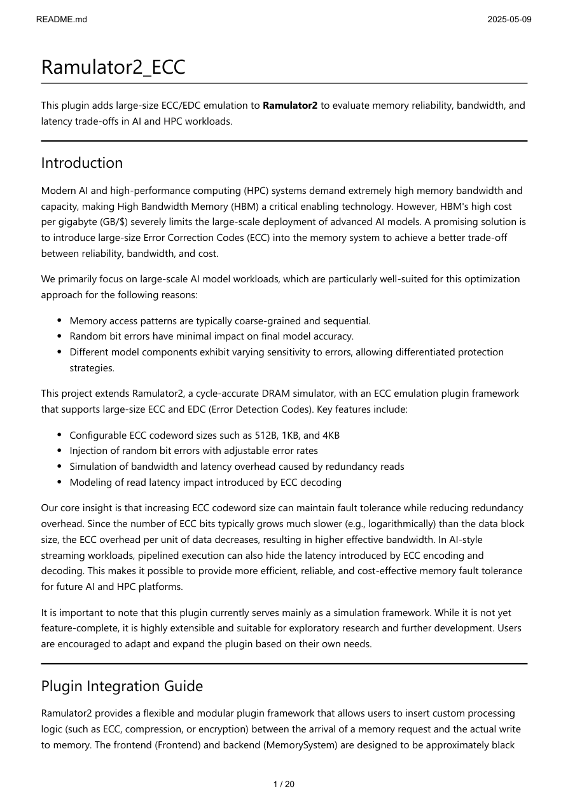

<p align="center">
  
</p>

<p align="center">Figure 1. A research path from a memory request through error detection, correction emulation, and the DRAM controller</p>

<div align="center">
  <h1>Ramulator2_ECC</h1>
  <p><strong>A large-granularity ECC/EDC memory-reliability research prototype for AI and HPC workloads</strong></p>
  <p>
    <a href="README.md">中文</a> ·
    <a href="#quickstart-en">Build entry</a> ·
    <a href="#status-en">Implementation status</a> ·
    <a href="#config-en">Configuration</a> ·
    <a href="#validation-en">Validation</a> ·
    <a href="docs/legacy/README-ecc-reference.md">Complete legacy technical reference</a>
  </p>
</div>

<p align="center">
  
  
  
  
  
  
  
</p>

> [!IMPORTANT]
> This repository is an experimental Ramulator 2.0 branch for studying large-granularity error-correction code (ECC) and error-detection code (EDC) trade-offs
> Several algorithms are simplified emulations or conceptual designs; results are not evidence about real HBM devices, production controllers, or hardware signoff

> [!WARNING]
> A fresh clone cannot complete CMake configuration
> `CMakeLists.txt` requires `ext/reed_solomon/reedSolomon.cpp`, but the directory is ignored and absent from the repository
> Builds stop during generation until a compatible, licensed copy of that dependency is restored

> [!CAUTION]
> `example_config_HBM3.yaml` declares `ecc_size` twice, once as 1024 and once as 32
> Duplicate-key behavior depends on the parser, so remove one key and make the intended value explicit before any experiment

Every number in this document comes from repository records, source configuration at commit `f332729a15f941ff1fc4956d364f73aa261a8111`, or an isolated check on August 24, 2026

<a id="overview-en"></a>
## 1 Positioning

Ramulator2_ECC adds `ECCPlugin` to the controller-plugin interface of the cycle-level DRAM simulator Ramulator 2.0 [1]
The plugin brings data blocks, EDC, ECC, random error injection, and counters into one request path to explore reliability, effective bandwidth, latency, and storage overhead

ECC detects and attempts to correct corrupted information
EDC detects whether information changed before a correction path is attempted
HBM means High Bandwidth Memory; this repository models selected behavior rather than a complete physical device

<div align="center">

Table 1.1 Repository composition

| Area | Current contents | Evidence |
| --- | --- | --- |
| Simulator core | DRAM, controller, frontend, mapping, statistics, and configuration | `src/` |
| ECC plugin | Read/write paths, EDC, simplified ECC, injection, and counters | `src/dram_controller/impl/plugin/ecc.cpp` |
| Example configs | DDR4, HBM3, BlockHammer, and PRAC | Four root YAML files |
| Example traces | Instruction, physical-address, attacker, and user traces | Four root `.trace` files |
| Research utilities | Simulator comparison, RowHammer studies, and trace generation | `perf_comparison/`, `rh_study/` |
| Hardware checks | Verilog assets derived from a Micron DDR4 model | `verilog_verification/` |
| Upstream guide | Original Ramulator 2.0 usage and reproduction material | `README_Original.md` |
| Legacy ECC guide | Exact snapshot of the previous 35,037-byte README | `docs/legacy/README-ecc-reference.md` |

</div>

<a id="status-en"></a>
## 2 Implementation status

<p align="center">
  
</p>

<p align="center">Figure 2.1 Evidence matrix derived from committed code and a fresh-clone check</p>

<div align="center">

Table 2.1 Capability maturity

| Capability | Status | Code evidence |
| --- | --- | --- |
| Checksum, CRC32, CRC64 | Implemented | `calculateEDC()` produces fixed-length byte vectors |
| Random bit flips | Implemented | `inject_random_errors()` samples every bit using the configured probability |
| Dynamic ECC-size estimate | Formula implemented | Binomial search finds minimum `t`, then uses `2 × t` up to `ECC_SIZE` |
| Hamming encoding | Simplified | XOR the full block and repeat the parity in every ECC byte |
| BCH encoding | Simplified | Same parity behavior, not BCH polynomial encoding |
| Hamming and BCH decoding | Placeholder | Neither branch repairs data, and the function finally returns success |
| Reed-Solomon encoding | Incomplete | The external class generates a random message instead of receiving input data |
| Reed-Solomon decoding | Unverified | Missing dependency sources block the build |
| Partial write | Placeholder | `offset` and `length` are fixed at zero |
| Retry, RAID, and fatal UE | Conceptual | Fixed failure booleans and TODO comments only |
| Latency, bandwidth, and cost | Documentation formulas | Corresponding runtime accumulators are commented out |

</div>

UE means Uncorrectable Error; the plugin does not yet report it reliably to an upper layer

<a id="architecture-en"></a>
## 3 Architecture

<div align="center">



Figure 3.1 Ramulator2 ECC component relationships

</div>

The plugin derives from `IControllerPlugin` and `Implementation` and registers through Ramulator's implementation macro
`init()` reads parameters and registers statistics, `setup()` binds the controller, `update()` processes requests, and `finalize()` clears internal maps

<a id="flow-en"></a>
## 4 Request processing

<div align="center">

Table 4.1 Current paths

| Request | Current behavior | Important boundary |
| --- | --- | --- |
| Write | Read payload or generate random data, calculate EDC and dynamic-size ECC, then store by address | Error injection occurs on generated data when payload is absent |
| Read hit | Split data and EDC, return data after a successful EDC check | A null payload only updates statistics |
| Read miss | Generate random data and EDC, inject errors, and create ECC | This is simulated content, not real DRAM state |
| EDC failure | Call `decodeECC()`, then regenerate EDC and ECC on success | Hamming and BCH may report success without repair |
| PartialWrite | Enter incremental RS-update code | Fixed zero length means no valid region is changed |
| Finalize | Clear data and ECC maps | Print two cleanup lines |

</div>

<div align="center">



Figure 4.1 Current read-request control flow

</div>

<a id="config-en"></a>
## 5 Configuration

<div align="center">

Table 5.1 `ECCPlugin` parameters

| YAML key | Default | Current purpose | Boundary |
| --- | ---: | --- | --- |
| `data_block_size` | 128 bytes | Generate, copy, and split data blocks | A payload shorter than this value can be over-read |
| `edc_size` | 4 bytes | Set EDC vector length | CRC32 writes at most 4 bytes and CRC64 at most 8 |
| `ecc_size` | 8 bytes | Cap dynamic ECC size | The HBM3 example contains duplicate keys |
| `ecc_type` | `bch` | Select Hamming, RS, or BCH | Hamming and BCH decoding are placeholders |
| `edc_type` | `crc32` | Select checksum, CRC32, or CRC64 | An unknown value silently returns zero bytes |
| `bit_error_rate` | `1e-6` | Drive injection and strength estimation | `random_device` makes experiments non-reproducible |
| `max_failure_prob` | `1e-14` | Set the dynamic-strength target | A formula input, not a hardware guarantee |

</div>

<div align="center">

Table 5.2 HBM3 example

| Item | Committed value | Audit conclusion |
| --- | --- | --- |
| Frontend | SimpleO3, clock ratio 8 | Reads `user_trace.trace` |
| Memory system | GenericDRAM, clock ratio 3 | Uses the generic memory system |
| DRAM | HBM3, 1 channel, 2 pseudochannels | Uses `HBM3_2Gb` and `HBM3_2Gbps` presets |
| Controller | Generic, FRFCFS, AllBank, OpenRowPolicy | Plugin is under `Controller.plugins` |
| Data block | 128 bytes | Matches the plugin default |
| EDC | 4-byte CRC32 | Reaches the implemented Boost CRC32 path |
| ECC | Both 1024 and 32 bytes, type BCH | Duplicate key and placeholder algorithm must be resolved |
| Error target | BER `1e-6`, failure probability `1e-14` | Input assumptions rather than measured results |

</div>

<a id="formulas-en"></a>
## 6 Formula boundaries

The previous README contains storage, latency, bandwidth, error-probability, and cost formulas; all of it remains in the [legacy technical reference](docs/legacy/README-ecc-reference.md)
Most formulas are not connected to runtime plugin statistics and should be treated as analysis templates

<div align="center">

Table 6.1 Main formulas

| Metric | Expression | Current evidence boundary |
| --- | --- | --- |
| Redundant storage ratio | `(ECC + EDC) / (Data + ECC + EDC)` | Must use the actual generated codeword size |
| Usable-data ratio | `Data / (Data + ECC + EDC)` | Not integrated into DRAM capacity |
| Transfer time | `Transferred bytes / bus bandwidth` | Bandwidth constants exist; timing counters are commented out |
| Read latency | `DRAM read + EDC check + conditional ECC read and decode` | Components are not accumulated by current code |
| Symbol-error rate | `1 - (1 - BER)^8` | Dynamic estimate treats one byte as one symbol |
| Failure probability | `1 - BinomialCDF(t, n, q)` | Code searches for the smallest qualifying `t` |

</div>

In the RS path, `ReedSolomonEncode()` returns data length plus ECC length, and the entire vector is saved in `m_ecc_storage`
Consequently, `ecc_total_size_bytes` cannot be interpreted directly as pure redundancy

<a id="quickstart-en"></a>
## 7 Build entry

### 7.1 Current blocker

A fresh clone lacks `ext/reed_solomon/reedSolomon.cpp` and its header
No submodule, download script, or provenance record identifies a safe source for that dependency

- Step 1: restore `ext/reed_solomon/` from an authorized, version-matched source and record its license and commit

- Step 2: remove one duplicated `ecc_size` key from `example_config_HBM3.yaml`

- Step 3: configure and build under Linux or WSL

```bash
cmake -S . -B build -DCMAKE_BUILD_TYPE=Release # Configure a C++20 Release build and fetch declared public dependencies
cmake --build build --parallel 4 # Build the shared library and ramulator2 executable
cp build/ramulator2 ./ramulator2 # Match the output location assumed by the Windows helper scripts
```

- Step 4: run the corrected HBM3 example and retain its log

```bash
./ramulator2 -f ./example_config_HBM3.yaml # Run the HBM3 example after duplicate-key removal
```

### 7.2 Windows helpers

`make_build.bat` creates `build/` under WSL, runs CMake and Make, and copies the executable
`build.bat` rebuilds an existing build directory
`exec_HBM3.bat` launches the HBM3 configuration through WSL
All three pause for keyboard input and are not ready-made CI commands

<a id="extension-en"></a>
## 8 Plugin extension

The original integration guide remains in the legacy reference; this is its navigation version

- Step 1: read the interface and registration mechanism in `src/dram_controller/plugin.h`

- Step 2: create an implementation under `src/dram_controller/impl/plugin/`

- Step 3: inherit from both `IControllerPlugin` and `Implementation`

- Step 4: register the implementation with `RAMULATOR_REGISTER_IMPLEMENTATION`

- Step 5: implement the `init()`, `setup()`, `update()`, and `finalize()` lifecycle

- Step 6: add the implementation file to `src/dram_controller/CMakeLists.txt`

- Step 7: enable the implementation under the controller's YAML `plugins` list

- Step 8: validate statistics, error paths, and reproducibility with a minimal trace

<a id="trace-en"></a>
## 9 Traces and statistics

<div align="center">

Table 9.1 Research inputs

| Path | Purpose | Current status |
| --- | --- | --- |
| `example_inst.trace` | SimpleO3 instruction trace | Referenced by DDR4, BH, and PRAC configs |
| `user_trace.trace` | HBM3 example input | Referenced by the HBM3 config |
| `example_rh_physaddr.trace` | RowHammer physical-address stream | Referenced by the BH config |
| `example_prac_attacker.trace` | PRAC attacker stream | Referenced by the PRAC config |
| `trace_generator.py` | Custom instruction-trace generator | Python syntax check passed |

</div>

<div align="center">

Table 9.2 Registered plugin statistics

| Name | Records | Interpretation boundary |
| --- | --- | --- |
| `ecc_total_size_bytes` | Accumulated ECC-storage vector length on writes | RS vectors may include data length |
| `edc_total_size_bytes` | Accumulated configured EDC length on writes | Address overwrites still increase the counter |
| `edc_success_count` | Read-time EDC matches | Not application-level accuracy |
| `edc_failure_count` | Read-time EDC mismatches | Influenced by non-reproducible random injection |
| `ecc_success_count` | Decoder success return values | Hamming and BCH success may be placeholder behavior |
| `ecc_failure_count` | Decoder failures | Retry and RAID recovery are absent |

</div>

Configuration values and five fixed performance assumptions are also exported through the statistics system, while latency accumulators remain commented out

<a id="validation-en"></a>
## 10 Validation record

<div align="center">

Table 10.1 Checks on August 24, 2026

| Check | Result | Method |
| --- | --- | --- |
| Repository | 190 tracked files, about 1,904,556 bytes | `git ls-files` and file-size sum |
| C++ scope | 120 source or header files | Extension count |
| Python scope | 12 scripts | Extension count |
| Python syntax | All 12 passed | Python `py_compile` |
| CMake | 3.28.3 | WSL tool version |
| GNU C++ | 13.3.0 | WSL tool version |
| Fresh-clone configuration | Failed | Missing `ext/reed_solomon/reedSolomon.cpp` |
| Public dependencies | yaml-cpp 0.7.0, spdlog 1.11.0, argparse 2.9 | CMake tags |
| Boost | WSL found 1.83.0 | CMake log |
| GitHub automation | No workflows | Repository metadata |
| Releases | No tags or Releases | Git and GitHub metadata |

</div>

Configuration fetched the three public dependencies and found Boost, then failed while generating the `reedSolomon` target
No executable was produced, so this README does not invent throughput, latency, error-rate, or correction-success results

<a id="structure-en"></a>
## 11 Repository map

<div align="center">

Table 11.1 Directory responsibilities

| Path | Responsibility | Suggested entry |
| --- | --- | --- |
| `src/` | Ramulator core and ECC plugin | Start with `ecc.cpp` and controller interfaces |
| `resources/gem5_wrappers/` | gem5 integration wrappers | Use the upstream library-mode guide |
| `perf_comparison/` | Multi-simulator comparison scripts and patches | Requires additional simulators and traces |
| `rh_study/` | RowHammer helper scripts and notebook | Separate from ECC-plugin validation |
| `verilog_verification/` | DDR4 model verification assets | Requires commercial or external simulation tools |
| `README_Original.md` | Complete upstream Ramulator 2.0 guide | Retains upstream features and paper reproduction |
| `README.pdf` | 20-page legacy snapshot generated May 9, 2025 | Not evidence of current build health |
| `docs/legacy/` | Exact previous README snapshot | Prevents information loss during landing-page redesign |

</div>

<a id="legacy-en"></a>
## 12 Historical material

<p align="center">
  
</p>

<p align="center">Figure 12.1 First page of `README.pdf`, whose metadata says Chromium generated it on May 9, 2025</p>

All 35,037 bytes of the previous README are preserved in [`docs/legacy/README-ecc-reference.md`](docs/legacy/README-ecc-reference.md)
It covers ECC and EDC design, redundant-read experiments, statistics, controller tick logic, storage, latency, bandwidth, error and cost formulas, trace format, conceptual metadata, dynamic ECC, and the previous limitations list

`README_Original.md` continues to preserve upstream Ramulator 2.0 usage, extension, Verilog verification, performance-comparison, and RowHammer-study guidance

<a id="security-en"></a>
## 13 Security boundary

<div align="center">

Table 13.1 Supply-chain and privacy checks

| Area | Current fact | Recommendation |
| --- | --- | --- |
| Missing dependency | Reed-Solomon provenance and license are unknown | Record repository, commit, and license when restoring it |
| FetchContent | Three tags are pinned without content hashes | Build from controlled mirrors or immutable commits |
| Container | Compose uses a third-party image without a digest | Audit it and pin an immutable digest |
| Traces | Workload addresses and behavior may be sensitive | Never commit private model or production traces |
| Logs | Statistics may expose configuration and experiment traits | Remove paths, hostnames, and private identifiers before sharing |
| Documentation | Uses public repositories and local commands only | Do not add deployment URLs, accounts, tokens, or keys |

</div>

<a id="limitations-en"></a>
## 14 Known limitations

- Fresh clones cannot build because Reed-Solomon sources are absent
- The HBM3 example duplicates `ecc_size`
- Hamming and BCH are repeated parity bytes, with no real decoding
- Reed-Solomon encoding generates a random message instead of encoding the input block
- Partial-write offset and length are fixed at zero
- Retry, RAID recovery, and fatal UE reporting are not implemented
- Error injection uses a non-deterministic seed
- Latency, bandwidth, cost, and error-effectiveness counters are not integrated
- RS storage vectors may include data, contaminating the ECC-byte statistic
- Unknown EDC types return zero vectors instead of failing fast
- In-memory maps do not reproduce real DRAM capacity or lifetime
- There are no unit tests, CI workflows, version tags, or Releases

<a id="contributing-en"></a>
## 15 Collaboration path

Recommended priorities are:

- P0: restore and document the Reed-Solomon dependency so a fresh clone builds
- P0: remove duplicate YAML keys and add strict configuration validation
- P0: add known-vector tests for Hamming, BCH, and RS encode/decode paths
- P1: make the error-injection seed explicit
- P1: implement partial writes, retries, and uncorrectable-error reporting
- P1: connect latency, bandwidth, capacity, and reliability statistics
- P2: add CI, a benchmark protocol, and reproducible experiment packages

The repository uses the MIT License in [`LICENSE`](LICENSE), whose copyright notice belongs to the SAFARI Research Group at ETH Zurich and Carnegie Mellon University
Plugin contributions should include configuration, a minimal trace, random seed, expected counters, and observed statistics

## 16 References

[1] SAFARI Research Group, “Ramulator 2.0,” GitHub, 2023. [Online]. Available: https://github.com/CMU-SAFARI/ramulator2. [Accessed: Aug. 24, 2026].

[2] H. Luo et al., “Ramulator 2.0: A Modern, Modular, and Extensible DRAM Simulator,” arXiv, 2023. [Online]. Available: https://arxiv.org/abs/2308.11030. [Accessed: Aug. 24, 2026].

[3] J. Beder, “yaml-cpp,” GitHub. [Online]. Available: https://github.com/jbeder/yaml-cpp. [Accessed: Aug. 24, 2026].

[4] G. Campana et al., “spdlog,” GitHub. [Online]. Available: https://github.com/gabime/spdlog. [Accessed: Aug. 24, 2026].

[5] P. Ranav, “argparse,” GitHub. [Online]. Available: https://github.com/p-ranav/argparse. [Accessed: Aug. 24, 2026].

[6] AIALRA-0, “Ramulator2_ECC,” GitHub. [Online]. Available: https://github.com/AIALRA-0/Ramulator2_ECC. [Accessed: Aug. 24, 2026].
