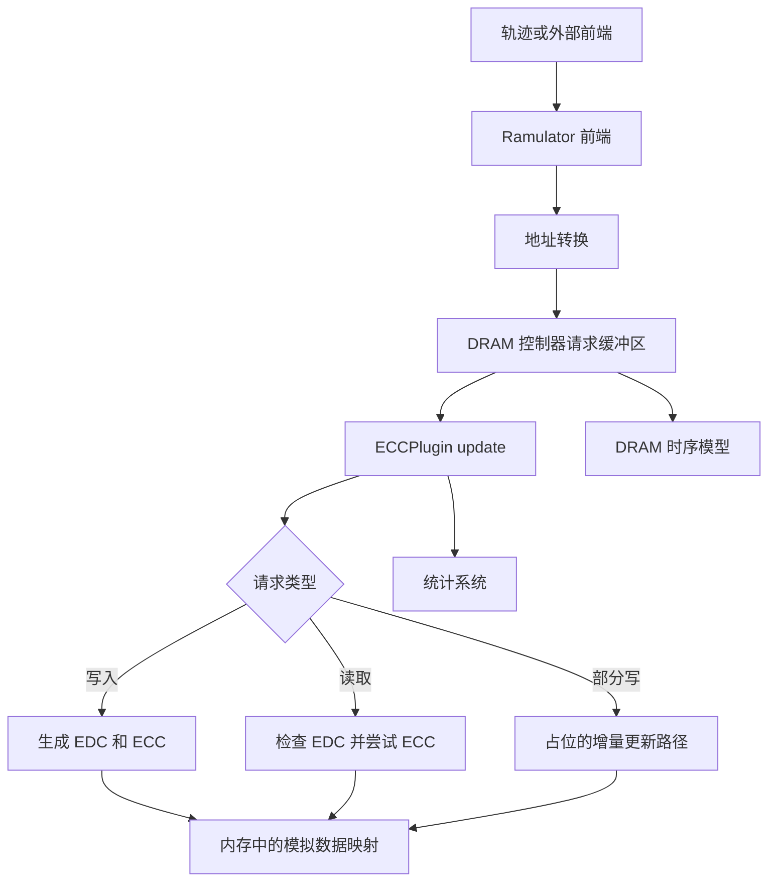
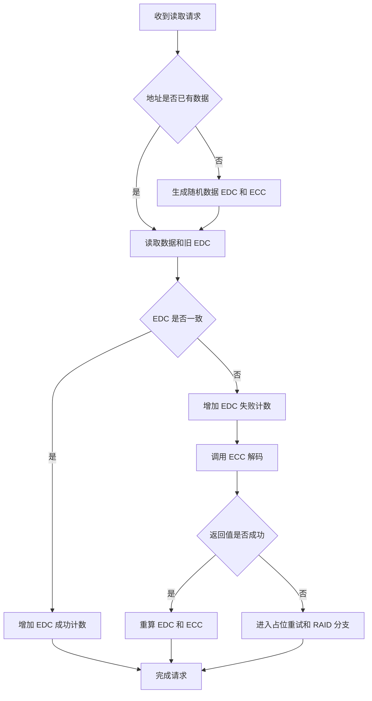

<p align="center">
  
</p>

<p align="center">图 1 内存请求经过错误检测、纠错模拟和 DRAM 控制器的研究链路</p>

<div align="center">
  <h1>Ramulator2_ECC</h1>
  <p><strong>面向人工智能与高性能计算负载的大粒度 ECC/EDC 内存可靠性研究原型</strong></p>
  <p>
    <a href="README.en.md">English</a> ·
    <a href="#quickstart-cn">构建入口</a> ·
    <a href="#status-cn">实现状态</a> ·
    <a href="#config-cn">配置参数</a> ·
    <a href="#validation-cn">验证记录</a> ·
    <a href="docs/legacy/README-ecc-reference.md">完整旧版技术说明</a>
  </p>
</div>

<p align="center">
  
  
  
  
  
  
  
</p>

> [!IMPORTANT]
> 当前仓库是 Ramulator 2.0 的实验性分支，主要研究大粒度纠错码 ECC 和错误检测码 EDC 的开销与可靠性权衡
> 多项算法仍是简化模拟或概念设计，结果不能代表真实 HBM 芯片、量产控制器或硬件签核结论

> [!WARNING]
> 全新克隆目前无法完成 CMake 配置
> `CMakeLists.txt` 要求 `ext/reed_solomon/reedSolomon.cpp`，但该目录被 `.gitignore` 排除且没有提交到仓库
> 在合法取得并恢复匹配的 Reed-Solomon 源码前，构建命令会停在生成阶段

> [!CAUTION]
> `example_config_HBM3.yaml` 连续定义了两次 `ecc_size`，分别为 1024 和 32
> 重复键的处理取决于解析器，运行实验前必须删除其中一个并明确预期值

本文所有数值来自提交 `f332729a15f941ff1fc4956d364f73aa261a8111` 的仓库记录、源代码配置或 2026-08-24 的隔离检查

<a id="overview-cn"></a>
## 1 项目定位

Ramulator2_ECC 在周期级 DRAM 模拟器 Ramulator 2.0 [1] 的控制器插件接口中加入 `ECCPlugin`
插件尝试把数据块、EDC、ECC、随机错误注入和统计计数组织到同一条请求处理链路，以探索可靠性、有效带宽、延迟和存储开销之间的关系

ECC 是 Error Correction Code 的缩写，中文为纠错码，用于在错误数量不超过能力范围时恢复数据
EDC 是 Error Detection Code 的缩写，中文为错误检测码，用于先发现数据是否改变
HBM 是 High Bandwidth Memory 的缩写，中文为高带宽内存，它面向高吞吐计算，但本项目只模拟部分行为

<div align="center">

表 1.1 仓库组成

| 组成 | 当前内容 | 证据位置 |
| --- | --- | --- |
| 模拟器核心 | DRAM、控制器、前端、地址映射、统计和配置框架 | `src/` |
| ECC 插件 | 读写路径、EDC、简化 ECC、错误注入和统计 | `src/dram_controller/impl/plugin/ecc.cpp` |
| 示例配置 | DDR4、HBM3、BlockHammer 和 PRAC | 根目录四个 YAML 文件 |
| 示例轨迹 | 指令、物理地址、攻击者和用户轨迹 | 根目录四个 `.trace` 文件 |
| 研究工具 | 性能比较、RowHammer 研究和轨迹生成脚本 | `perf_comparison/`、`rh_study/` |
| 硬件核对 | Micron DDR4 模型相关的 Verilog 验证材料 | `verilog_verification/` |
| 上游说明 | Ramulator 2.0 原始使用和复现实验文档 | `README_Original.md` |
| ECC 旧说明 | 原有 35,037 字节 README 的完整快照 | `docs/legacy/README-ecc-reference.md` |

</div>

<a id="status-cn"></a>
## 2 实现状态

<p align="center">
  
</p>

<p align="center">图 2.1 依据提交代码和全新克隆检查整理的实现证据矩阵</p>

<div align="center">

表 2.1 能力成熟度

| 能力 | 状态 | 代码事实 |
| --- | --- | --- |
| Checksum、CRC32、CRC64 | 已实现 | `calculateEDC()` 生成固定长度字节向量 |
| 随机位翻转 | 已实现 | `inject_random_errors()` 按配置概率逐位采样 |
| 动态 ECC 大小估计 | 已实现公式 | 二项分布寻找最小 `t`，再采用 `2 × t`，上限取 `ECC_SIZE` |
| Hamming 编码 | 简化模拟 | 对整个数据块异或，并把同一奇偶值重复到每个 ECC 字节 |
| BCH 编码 | 简化模拟 | 与 Hamming 路径相同，尚不是实际 BCH 多项式编码 |
| Hamming 与 BCH 解码 | 占位 | 分支没有修复数据，函数最终返回成功 |
| Reed-Solomon 编码 | 不完整 | 调用外部类生成随机消息，没有把输入数据交给编码器 |
| Reed-Solomon 解码 | 不可验证 | 依赖源码缺失，当前仓库无法构建该路径 |
| 部分写 | 占位 | `offset` 和 `length` 固定为 0，旧数据修复仍为待办 |
| 重试、RAID 和致命 UE | 概念 | 布尔值固定为失败，只有待办注释，没有恢复动作 |
| 延迟、带宽和成本模型 | 文档公式 | 代码中的相关统计变量已注释，没有接入运行时计时 |

</div>

注：UE 是 Uncorrectable Error 的缩写，中文为不可纠正错误，当前插件尚未把它可靠上报给上层系统

<a id="architecture-cn"></a>
## 3 系统结构

<div align="center">



图 3.1 Ramulator2 ECC 组件关系

</div>

插件由 `IControllerPlugin` 和 `Implementation` 派生，通过 Ramulator 注册宏加入控制器
`init()` 读取参数并注册统计，`setup()` 绑定控制器，`update()` 处理请求，`finalize()` 清空插件内部映射

<a id="flow-cn"></a>
## 4 请求处理

<div align="center">

表 4.1 当前读写路径

| 请求 | 当前行为 | 关键限制 |
| --- | --- | --- |
| Write | 获取载荷或生成随机块，计算 EDC 和动态大小 ECC，再按地址保存 | 缺少载荷时才对生成数据注入错误 |
| Read 命中 | 拆分数据和 EDC，EDC 通过后把数据复制到载荷 | 载荷为空时只更新统计 |
| Read 未命中 | 生成随机数据和 EDC，再注入错误并补建 ECC | 这是模拟数据，不是 DRAM 中的真实内容 |
| EDC 失败 | 调用 `decodeECC()`，成功后重算并覆盖数据与 ECC | Hamming 与 BCH 会在没有修复数据时返回成功 |
| PartialWrite | 进入增量 RS 更新路径 | 长度固定为 0，当前不会更新有效区域 |
| Finalize | 清空数据和 ECC 映射 | 输出两条清理日志 |

</div>

<div align="center">



图 4.1 读取请求的当前控制流

</div>

<a id="config-cn"></a>
## 5 配置参数

<div align="center">

表 5.1 `ECCPlugin` 参数

| YAML 键 | 默认值 | 当前用途 | 限制 |
| --- | ---: | --- | --- |
| `data_block_size` | 128 字节 | 生成、复制和拆分数据块 | 大于载荷真实长度时可能越界读取 |
| `edc_size` | 4 字节 | 决定 EDC 向量长度 | CRC32 最多写 4 字节，CRC64 最多写 8 字节 |
| `ecc_size` | 8 字节 | 动态 ECC 大小的最大值 | HBM3 示例存在重复键 |
| `ecc_type` | `bch` | 选择 Hamming、RS 或 BCH 路径 | Hamming 和 BCH 解码为占位实现 |
| `edc_type` | `crc32` | 选择 checksum、CRC32 或 CRC64 | 未知值会返回全零 EDC，不会报错 |
| `bit_error_rate` | `1e-6` | 随机位翻转和动态强度估计 | 随机种子来自 `random_device`，实验不可复现 |
| `max_failure_prob` | `1e-14` | 动态强度目标 | 只影响公式估计，不构成硬件可靠性证明 |

</div>

<div align="center">

表 5.2 HBM3 示例配置

| 项目 | 提交值 | 审计结论 |
| --- | --- | --- |
| 前端 | SimpleO3，时钟比 8 | 读取 `user_trace.trace` |
| 内存系统 | GenericDRAM，时钟比 3 | 使用通用 DRAM 系统 |
| DRAM | HBM3，1 通道，2 个伪通道 | 采用 `HBM3_2Gb` 与 `HBM3_2Gbps` 预设 |
| 控制器 | Generic、FRFCFS、AllBank、OpenRowPolicy | 插件挂在 `Controller.plugins` |
| 数据块 | 128 字节 | 与插件默认值一致 |
| EDC | 4 字节，CRC32 | 可进入真实 Boost CRC32 路径 |
| ECC | 同时写有 1024 和 32 字节，类型为 BCH | 必须先解决重复键和占位算法 |
| 错误目标 | BER `1e-6`，失败概率 `1e-14` | 属于输入假设，不是测量结果 |

</div>

<a id="formulas-cn"></a>
## 6 公式边界

旧 README 提供了存储、延迟、带宽、错误概率和成本公式，完整内容保存在[旧版技术说明](docs/legacy/README-ecc-reference.md)
这些公式目前没有全部连接到插件运行时统计，应当作为分析模板使用

<div align="center">

表 6.1 主要公式

| 指标 | 表达式 | 当前证据边界 |
| --- | --- | --- |
| 冗余存储比例 | `(ECC + EDC) / (Data + ECC + EDC)` | 需要使用实际生成的码字大小 |
| 可用数据比例 | `Data / (Data + ECC + EDC)` | 未写入 DRAM 容量模型 |
| 传输时间 | `传输字节数 / 总线带宽` | 带宽常量存在，计时统计被注释 |
| 读延迟 | `DRAM 读取 + EDC 检查 + 必要时 ECC 读取和解码` | 当前代码没有累计这些分量 |
| 符号错误率 | `1 - (1 - BER)^8` | 动态强度估计按 1 字节为 1 个符号 |
| 失败概率 | `1 - BinomialCDF(t, n, q)` | 代码寻找满足目标的最小 `t` |

</div>

使用 Reed-Solomon 路径时，当前 `ReedSolomonEncode()` 返回的向量长度是数据长度加 ECC 长度，却被整个保存为 `m_ecc_storage`
因此 `ecc_total_size_bytes` 不能直接解释为纯冗余字节

<a id="quickstart-cn"></a>
## 7 构建入口

### 7.1 当前阻断

全新克隆缺少 `ext/reed_solomon/reedSolomon.cpp` 和对应头文件
仓库没有子模块声明、下载脚本或来源说明，README 不能安全猜测该依赖应从哪里取得

- 第一步，从有授权且版本匹配的来源恢复 `ext/reed_solomon/`，并补充许可证与固定版本

- 第二步，删除 `example_config_HBM3.yaml` 中重复的 `ecc_size`，保留实验需要的单一值

- 第三步，在 Linux 或 WSL 中配置并构建

```bash
cmake -S . -B build -DCMAKE_BUILD_TYPE=Release # 配置 C++20 Release 构建并下载已固定的公开依赖
cmake --build build --parallel 4 # 编译共享库和 ramulator2 可执行文件
cp build/ramulator2 ./ramulator2 # 与现有 Windows 包装脚本保持相同输出位置
```

- 第四步，运行 HBM3 示例并保存日志

```bash
./ramulator2 -f ./example_config_HBM3.yaml # 使用已经消除重复键的 HBM3 配置运行模拟
```

### 7.2 Windows 包装脚本

`make_build.bat` 在 WSL 中创建 `build/`、运行 CMake 和 Make，并复制可执行文件
`build.bat` 只在已有构建目录中重新编译
`exec_HBM3.bat` 通过 WSL 运行 HBM3 配置
三个脚本都会等待键盘输入，适合人工操作，不适合直接作为持续集成命令

<a id="extension-cn"></a>
## 8 插件扩展

原 README 的插件接入步骤保存在旧版技术说明中，下面提供不改变含义的导航版本

- 第一步，阅读 `src/dram_controller/plugin.h` 的接口和注册机制

- 第二步，在 `src/dram_controller/impl/plugin/` 新建实现文件

- 第三步，让实现类同时继承 `IControllerPlugin` 和 `Implementation`

- 第四步，使用 `RAMULATOR_REGISTER_IMPLEMENTATION` 注册实现名称和描述

- 第五步，实现 `init()`、`setup()`、`update()` 和 `finalize()` 生命周期

- 第六步，在 `src/dram_controller/CMakeLists.txt` 中加入实现文件

- 第七步，在 YAML 的控制器 `plugins` 列表中启用实现并写明参数

- 第八步，用最小轨迹验证统计、错误路径和可复现性

<a id="trace-cn"></a>
## 9 研究数据

<div align="center">

表 9.1 研究输入

| 路径 | 用途 | 当前状态 |
| --- | --- | --- |
| `example_inst.trace` | SimpleO3 指令轨迹示例 | DDR4、BH 和 PRAC 配置引用 |
| `user_trace.trace` | HBM3 示例输入 | HBM3 配置引用 |
| `example_rh_physaddr.trace` | RowHammer 物理地址流 | BH 配置引用 |
| `example_prac_attacker.trace` | PRAC 攻击者流 | PRAC 配置引用 |
| `trace_generator.py` | 生成自定义指令轨迹 | Python 语法检查通过 |

</div>

<div align="center">

表 9.2 插件已注册统计

| 统计名 | 记录内容 | 解释限制 |
| --- | --- | --- |
| `ecc_total_size_bytes` | 写入时累计 ECC 存储向量长度 | RS 路径可能包含数据长度 |
| `edc_total_size_bytes` | 写入时累计 EDC 配置长度 | 地址覆写仍会继续累计 |
| `edc_success_count` | 读取时 EDC 匹配次数 | 不代表应用层正确率 |
| `edc_failure_count` | 读取时 EDC 不匹配次数 | 受随机且不可复现的错误注入影响 |
| `ecc_success_count` | 解码函数返回成功次数 | Hamming 和 BCH 的成功可能是占位返回值 |
| `ecc_failure_count` | 解码函数返回失败次数 | 重试和 RAID 恢复没有实现 |

</div>

配置参数和五个固定性能假设也通过统计系统导出，但延迟累计变量在代码中被注释

<a id="validation-cn"></a>
## 10 验证记录

<div align="center">

表 10.1 2026-08-24 检查结果

| 检查 | 结果 | 方法 |
| --- | --- | --- |
| 仓库状态 | 190 个跟踪文件，约 1,904,556 字节 | `git ls-files` 与文件大小汇总 |
| C++ 范围 | 120 个 C++ 源文件或头文件 | 按扩展名统计 |
| Python 范围 | 12 个脚本 | 按扩展名统计 |
| Python 语法 | 12 个脚本全部通过 | Python `py_compile` |
| CMake | 3.28.3 | WSL 工具版本 |
| GNU C++ | 13.3.0 | WSL 工具版本 |
| 全新克隆配置 | 失败 | 缺少 `ext/reed_solomon/reedSolomon.cpp` |
| 上游公开依赖 | yaml-cpp 0.7.0、spdlog 1.11.0、argparse 2.9 | CMake 固定标签 |
| Boost | WSL 找到 1.83.0 | CMake 配置日志 |
| GitHub 自动化 | 没有工作流 | 仓库元数据检查 |
| 发布状态 | 没有标签和 Release | Git 与 GitHub 元数据检查 |

</div>

配置阶段成功下载三个公开依赖并找到 Boost，随后在生成目标 `reedSolomon` 时失败
本轮没有可执行文件，因此没有伪造吞吐量、延迟、错误率或纠错成功率

<a id="structure-cn"></a>
## 11 仓库导航

<div align="center">

表 11.1 目录职责

| 路径 | 职责 | 使用建议 |
| --- | --- | --- |
| `src/` | Ramulator 核心和 ECC 插件 | 先从 `ecc.cpp` 与控制器接口阅读 |
| `resources/gem5_wrappers/` | gem5 集成包装器 | 参考 `README_Original.md` 的库模式 |
| `perf_comparison/` | 多模拟器性能比较脚本和补丁 | 需要额外模拟器与轨迹 |
| `rh_study/` | RowHammer 研究辅助脚本和 Notebook | 与 ECC 插件不是同一验证路径 |
| `verilog_verification/` | DDR4 模型验证资源 | 依赖商业或外部仿真工具 |
| `README_Original.md` | 上游 Ramulator 2.0 完整说明 | 保留上游能力和论文复现信息 |
| `README.pdf` | 2025-05-09 生成的 20 页旧 README 快照 | 不是当前构建状态的证明 |
| `docs/legacy/` | 本轮保存的原 README | 防止首页重构造成信息丢失 |

</div>

<a id="legacy-cn"></a>
## 12 历史资料

<p align="center">
  
</p>

<p align="center">图 12.1 `README.pdf` 第一页，文件元数据中的创建日期为 2025-05-09，创建工具为 Chromium</p>

旧 README 原文已逐字复制到 [`docs/legacy/README-ecc-reference.md`](docs/legacy/README-ecc-reference.md)，原文件大小记录在表 1.1
其中包含 ECC 与 EDC 设计、冗余读实验、统计接入、控制器时钟逻辑、存储与延迟公式、带宽与成本公式、轨迹格式、概念元数据、动态 ECC 和原有限制清单

`README_Original.md` 继续保存 Ramulator 2.0 的上游使用、扩展、Verilog 验证、性能比较和 RowHammer 研究说明

<a id="security-cn"></a>
## 13 安全边界

<div align="center">

表 13.1 供应链和隐私检查

| 项目 | 当前事实 | 建议 |
| --- | --- | --- |
| 缺失依赖 | Reed-Solomon 源码来源和许可证未知 | 恢复时记录仓库、提交和许可证 |
| FetchContent | 三个依赖固定标签但没有内容哈希 | 在受控镜像或锁定提交上构建 |
| 容器 | Compose 使用未固定摘要的第三方开发镜像 | 运行前审计镜像并固定不可变摘要 |
| 轨迹 | 可能包含工作负载地址和行为 | 不提交私有模型或生产轨迹 |
| 日志 | 统计可能暴露配置和实验特征 | 分享前移除路径、主机名和私有标识 |
| 文档 | 只使用公开仓库链接和本机命令 | 不写入真实部署网址、账号、令牌或密钥 |

</div>

<a id="limitations-cn"></a>
## 14 已知限制

- 全新克隆无法构建，原因是 Reed-Solomon 源码未提交
- HBM3 示例有重复 `ecc_size` 键
- Hamming 与 BCH 只是重复奇偶字节，解码分支没有修复数据
- Reed-Solomon 编码器生成随机消息，没有编码传入的数据块
- 部分写的偏移和长度固定为 0
- 重试、RAID 恢复和致命 UE 上报没有实现
- 错误注入使用非确定随机种子，实验难以逐次复现
- 代码中的延迟、带宽和成本统计尚未接入
- RS 存储向量可能包含数据，ECC 字节统计口径不纯
- 未知 EDC 类型会返回全零向量，不会立即失败
- 插件内存映射不等同于真实 DRAM 容量和数据生命周期
- 没有单元测试、持续集成、版本标签或 Release

<a id="contributing-cn"></a>
## 15 协作路线

建议按以下优先级继续：

- P0，恢复并记录 Reed-Solomon 依赖，确保全新克隆可构建
- P0，删除重复 YAML 键，为配置增加严格校验
- P0，为 Hamming、BCH、RS 的编码和解码建立已知向量测试
- P1，把错误注入随机种子变成显式配置
- P1，实现部分写、重试和不可纠正错误上报
- P1，接通延迟、带宽、容量和错误率统计
- P2，建立持续集成、基准方法和可复现实验包

项目沿用根目录 [`LICENSE`](LICENSE) 中的 MIT 许可证，版权声明归 SAFARI Research Group at ETH Zurich and Carnegie Mellon University
提交插件修改时，请同时提供配置、最小轨迹、随机种子、预期计数和实际统计

## 16 参考资料

[1] SAFARI Research Group, “Ramulator 2.0,” GitHub, 2023. [Online]. Available: https://github.com/CMU-SAFARI/ramulator2. [Accessed: Aug. 24, 2026].

[2] H. Luo et al., “Ramulator 2.0: A Modern, Modular, and Extensible DRAM Simulator,” arXiv, 2023. [Online]. Available: https://arxiv.org/abs/2308.11030. [Accessed: Aug. 24, 2026].

[3] J. Beder, “yaml-cpp,” GitHub. [Online]. Available: https://github.com/jbeder/yaml-cpp. [Accessed: Aug. 24, 2026].

[4] G. Campana et al., “spdlog,” GitHub. [Online]. Available: https://github.com/gabime/spdlog. [Accessed: Aug. 24, 2026].

[5] P. Ranav, “argparse,” GitHub. [Online]. Available: https://github.com/p-ranav/argparse. [Accessed: Aug. 24, 2026].

[6] AIALRA-0, “Ramulator2_ECC,” GitHub. [Online]. Available: https://github.com/AIALRA-0/Ramulator2_ECC. [Accessed: Aug. 24, 2026].
